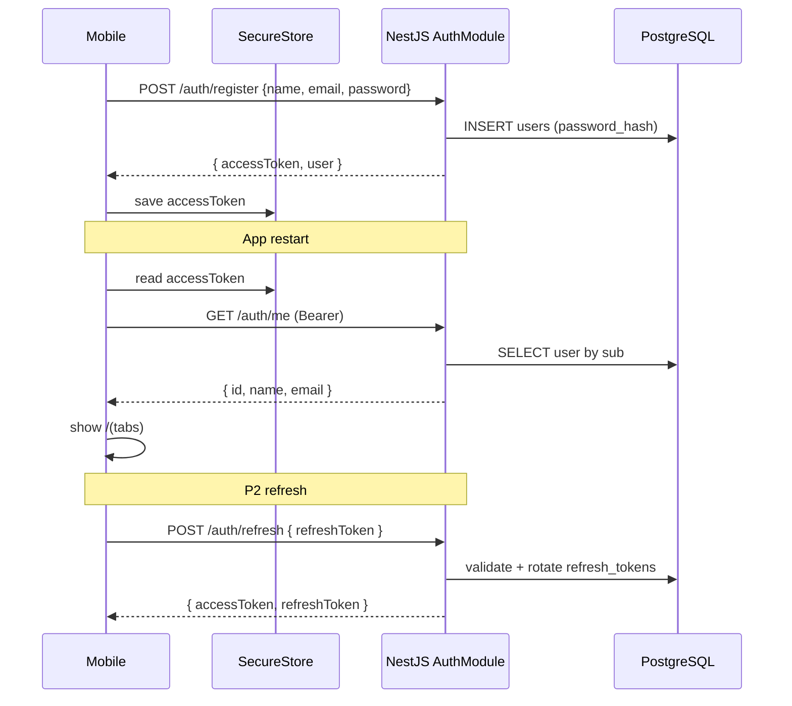
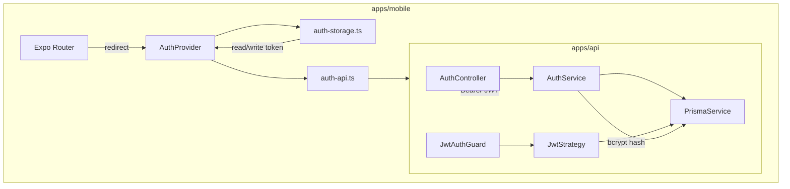

# Authentication Design

**Spec:** `.specs/features/authentication/spec.md`  
**Status:** Approved (ready for execute)  
**Milestone:** M1 — Fundação

---

## Architecture Overview

Autenticação **stateless JWT** emitida pela API NestJS. O mobile nunca fala com Supabase Auth — apenas envia credenciais ou tokens OAuth para a API, recebe JWT, persiste em `expo-secure-store` e anexa `Authorization: Bearer` em todas as chamadas autenticadas.





### Route Groups (Mobile)

```
app/
├── _layout.tsx              # QueryClient + AuthProvider + Stack
├── index.tsx                # Redirect: (tabs) | (auth)/login | splash
├── (auth)/
│   ├── _layout.tsx          # Stack sem header
│   ├── login.tsx
│   └── register.tsx
└── (tabs)/                  # Protegido — só acessível autenticado
    ├── _layout.tsx
    ├── index.tsx
    ├── areas.tsx
    ├── objetivos.tsx
    └── perfil.tsx           # nome, email, logout (+ edit P2)
```

---

## Code Reuse Analysis

### Existing Components to Leverage

| Component | Location | How to Use |
| --------- | -------- | ---------- |
| `PrismaService` | `apps/api/src/prisma/` | CRUD `users`, `refresh_tokens` (P2) |
| `env.validation.ts` | `apps/api/src/config/` | Estender Zod com `JWT_SECRET`, TTLs, OAuth keys |
| `HttpExceptionFilter` | `apps/api/src/common/filters/` | Erros 400/401/409 já formatados `{ statusCode, message, timestamp }` |
| `AppConfigModule` | `apps/api/src/config/` | `ConfigService` para JWT e OAuth |
| `apiFetch` | `apps/mobile/lib/api.ts` | Estender com header Bearer + parsing de erro JSON |
| `Screen` | `apps/mobile/components/Screen.tsx` | Layout das telas login/register/perfil |
| `theme.ts` | `apps/mobile/constants/theme.ts` | Inputs, botões, links auth (dark + primary) |
| `QueryClientProvider` | `apps/mobile/app/_layout.tsx` | `useMutation` login/register; `useQuery` me |

### Integration Points

| System | Integration Method |
| ------ | ------------------ |
| Health (`GET /health`) | Permanece **público** — sem guard |
| Auth endpoints | Públicos exceto `/auth/me`, `/auth/logout`, `PATCH /auth/me` |
| Future M2 modules | `@UseGuards(JwtAuthGuard)` + `@CurrentUser('id') userId: string` |
| CI | Stub `JWT_SECRET` no job `api` (32+ chars) para build/test |

**Sem `packages/shared` no P1** — tipos `User`, `AuthResponse` duplicados levemente em `apps/mobile/lib/auth.types.ts`. Reavaliar pacote shared se P2 OAuth aumentar superfície de DTOs.

---

## Tech Decisions

| Decision | Choice | Rationale | AUTH IDs |
| -------- | ------ | --------- | -------- |
| Password hashing | **bcrypt** (cost 12) | Ecossistema NestJS maduro; suficiente para MVP | AUTH-06–08 |
| Input validation | **Zod** schemas | Consistente com `env.validation.ts` | AUTH-01–03 |
| JWT library | `@nestjs/jwt` + `passport-jwt` | Padrão NestJS; `JwtStrategy` reutilizável | AUTH-11–15 |
| Access token TTL (P1) | **7d** | Sem refresh no P1; evita logout diário | AUTH-11 |
| Access token TTL (P2) | **15m** + refresh | Segurança após introduzir refresh | AUTH-40–43 |
| Refresh storage | **DB table** `refresh_tokens` (hash SHA-256) + **SecureStore** no mobile | Rotação one-time; revogável | AUTH-40–43 |
| Logout (P1) | **Client-only** | JWT stateless; limpar SecureStore + cache | AUTH-26–28 |
| OAuth account linking | **Auto-merge by email** | Google email verificado → popula `google_id` em user existente | AUTH-30–34 |
| OAuth mobile (P2) | **Em breve** — SDK nativo Google + `expo-apple-authentication` (iOS) | Adiado; UI placeholder `SocialAuthComingSoon` | AUTH-30–39 |
| OAuth verify (P2) | **Em breve** — verificação server-side na API | Nunca confiar só no client | AUTH-30–39 |
| Navigation guard | **AuthProvider** + `app/index.tsx` redirect | Simples; sem middleware Expo experimental | AUTH-16–20 |
| Global guard | **Opt-in per controller** + `@Public()` decorator | Health/auth públicos explícitos; M2 copia padrão | AUTH-21–25 |

---

## Data Models

### Prisma — User (migration `add_auth_fields`)

```prisma
model User {
  id           String   @id @default(uuid()) @db.Uuid
  name         String
  email        String   @unique
  passwordHash String?  @map("password_hash")
  googleId     String?  @unique @map("google_id")
  appleId      String?  @unique @map("apple_id")
  createdAt    DateTime @default(now()) @map("created_at")
  updatedAt    DateTime @updatedAt @map("updated_at")

  refreshTokens RefreshToken[]
  // ... relations existentes
}
```

### Prisma — RefreshToken (P2, migration `add_refresh_tokens`)

```prisma
model RefreshToken {
  id        String   @id @default(uuid()) @db.Uuid
  userId    String   @map("user_id") @db.Uuid
  tokenHash String   @map("token_hash")
  expiresAt DateTime @map("expires_at")
  createdAt DateTime @default(now()) @map("created_at")

  user User @relation(fields: [userId], references: [id], onDelete: Cascade)

  @@index([userId])
  @@map("refresh_tokens")
}
```

### API Types

```typescript
// apps/api/src/auth/auth.types.ts

export interface AuthUserDto {
  id: string;
  name: string;
  email: string;
  createdAt: string;
}

export interface AuthResponseDto {
  accessToken: string;
  refreshToken?: string; // P2
  user: AuthUserDto;
}

export interface JwtPayload {
  sub: string;   // user id
  email: string;
}
```

### Mobile Types

```typescript
// apps/mobile/lib/auth.types.ts — espelha AuthResponseDto
export interface AuthUser { id: string; name: string; email: string; createdAt: string; }
export interface AuthSession { accessToken: string; refreshToken?: string; user: AuthUser; }
```

---

## API Components

### AuthModule

- **Purpose:** Agrupa auth, JWT, Passport
- **Location:** `apps/api/src/auth/auth.module.ts`
- **Imports:** `JwtModule.registerAsync`, `PassportModule`, `PrismaModule`
- **Providers:** `AuthService`, `JwtStrategy`
- **Controllers:** `AuthController`
- **Exports:** `AuthService`, `JwtModule` (para guards em outros módulos)

### AuthService

- **Purpose:** Registro, login, tokens, perfil, OAuth (P2)
- **Location:** `apps/api/src/auth/auth.service.ts`
- **Interfaces:**

| Method | Description |
| ------ | ----------- |
| `register(dto)` | Valida Zod → hash bcrypt → create user → `issueTokens()` |
| `login(dto)` | Find by email → compare hash → `issueTokens()` ou erro OAuth-only |
| `validateUser(userId)` | Load user para JwtStrategy / `GET /auth/me` |
| `issueTokens(user)` | Sign JWT access (+ refresh P2) |
| `refresh(refreshToken)` | P2: hash lookup, rotate, new pair |
| `updateProfile(userId, name)` | P2: PATCH name |
| `loginWithGoogle(idToken)` | P2 (**em breve**): verify + find/create/link |
| `loginWithApple(idToken)` | P2 (**em breve**): verify + find/create/link |

- **Reuses:** `PrismaService`, `JwtService`, `ConfigService`

### AuthController

- **Location:** `apps/api/src/auth/auth.controller.ts`

| Method | Path | Guard | Body | Response | P |
| ------ | ---- | ----- | ---- | -------- | - |
| POST | `/auth/register` | `@Public()` | `{ name, email, password }` | `201 AuthResponseDto` | P1 |
| POST | `/auth/login` | `@Public()` | `{ email, password }` | `200 AuthResponseDto` | P1 |
| GET | `/auth/me` | `JwtAuthGuard` | — | `200 AuthUserDto` | P1 |
| POST | `/auth/logout` | `JwtAuthGuard` | — | `204` (no-op P1) | P1 |
| POST | `/auth/google` | `@Public()` | `{ idToken }` | `200 AuthResponseDto` | P2 (**em breve**) |
| POST | `/auth/apple` | `@Public()` | `{ idToken }` | `200 AuthResponseDto` | P2 (**em breve**) |
| POST | `/auth/refresh` | `@Public()` | `{ refreshToken }` | `200 AuthResponseDto` | P2 |
| PATCH | `/auth/me` | `JwtAuthGuard` | `{ name }` | `200 AuthUserDto` | P2 |

### JwtStrategy + Guards + Decorators

- **Location:** `apps/api/src/auth/strategies/jwt.strategy.ts`
- **Extract:** Bearer token → validate signature → `payload.sub` → `AuthService.validateUser`
- **JwtAuthGuard:** `AuthGuard('jwt')` wrapper
- **@Public():** SetMetadata — refletor skip guard (aplicar guard global opcionalmente no `AppModule` ou por-controller)
- **@CurrentUser():** Param decorator → `{ id, email }` ou `@CurrentUser('id')`

### Validation Schemas (Zod)

- **Location:** `apps/api/src/auth/schemas/`

```typescript
// register.schema.ts
export const registerSchema = z.object({
  name: z.string().trim().min(1).max(100),
  email: z.string().trim().email().max(255),
  password: z
    .string()
    .min(8)
    .regex(/[a-zA-Z]/, 'must contain a letter')
    .regex(/[0-9]/, 'must contain a number'),
});

// login.schema.ts
export const loginSchema = z.object({
  email: z.string().trim().email(),
  password: z.string().min(1),
});
```

Pipe custom `ZodValidationPipe` ou validação inline no controller — reutilizar padrão simples sem class-validator.

### Environment (extend `env.validation.ts`)

```typescript
JWT_SECRET: z.string().min(32),
JWT_ACCESS_EXPIRES_IN: z.string().default('7d'),

// P2 OAuth — optional when T7/T8 implemented
// GOOGLE_CLIENT_ID, GOOGLE_CLIENT_IDS, APPLE_* — see deferred-oauth.md
```

---

## Mobile Components

### auth-storage.ts

- **Purpose:** Wrapper `expo-secure-store`
- **Location:** `apps/mobile/lib/auth-storage.ts`
- **Keys:** `ascend_access_token`, `ascend_refresh_token` (P2)
- **Interfaces:** `getAccessToken()`, `setSession()`, `clearSession()`

### auth-api.ts

- **Purpose:** Chamadas auth tipadas
- **Location:** `apps/mobile/lib/auth-api.ts`
- **Uses:** `apiFetch` estendido com `Authorization` header opcional
- **Functions:** `register()`, `login()`, `getMe()`, `logout()`, `updateProfile()` (P2 OAuth **em breve**: `loginGoogle()`, `loginApple()`)

### AuthProvider

- **Purpose:** Estado global de sessão + bootstrap
- **Location:** `apps/mobile/providers/AuthProvider.tsx`
- **State:** `{ user, isLoading, isAuthenticated, signIn, signOut, signUp }`
- **Bootstrap:** mount → read SecureStore → `GET /auth/me` → set user ou clear
- **On 401 from me:** clear session (token expired — P1 redirect login; P2 try refresh first)

### lib/api.ts (extend)

```typescript
export async function apiFetch<T>(
  path: string,
  options?: RequestInit & { token?: string | null },
): Promise<T> {
  const headers = new Headers(options?.headers);
  if (options?.token) headers.set('Authorization', `Bearer ${options.token}`);
  // Parse error body: { statusCode, message } on !ok
}
```

### Auth UI Components (P1)

| Component | Location | Purpose |
| --------- | -------- | ------- |
| `AuthScreen` | `components/auth/AuthScreen.tsx` | Wrapper centrado, logo ASCEND + tagline |
| `AuthInput` | `components/auth/AuthInput.tsx` | TextInput estilizado NativeWind |
| `AuthButton` | `components/auth/AuthButton.tsx` | Primary CTA + loading state |
| `SocialAuthComingSoon` | `components/auth/SocialAuthComingSoon.tsx` | Placeholder: "Login com Google e Apple — em breve" |

**Visual (P1):** fundo `#0F172A`, inputs `bg-surface` (`#1E293B`), botão primary `#8B5CF6`, links `text-primary`. Reutilizar tagline "Consistência que transforma" no topo das telas auth.

### Expo Router Flow

1. `app/index.tsx` — while `isLoading` → spinner/splash; else `Redirect`
2. Login success → `signIn(session)` → `router.replace('/(tabs)')`
3. Logout → `signOut()` → `router.replace('/(auth)/login')`
4. `(tabs)/_layout` — não precisa guard extra se index redirect funciona; optional `useEffect` redirect se !authenticated

---

## Error Handling Strategy

| Error Scenario | API | Mobile UX |
| -------------- | --- | --------- |
| Email já registrado | `409` "Email already registered" | Mensagem abaixo do form |
| Senha inválida no registro | `400` com regras Zod | Inline validation + API message |
| Credenciais login inválidas | `401` "Invalid email or password" | Alert/texto genérico |
| Conta OAuth-only no login email | `401` "This account uses social sign-in, which is not available yet" | Placeholder social login (em breve) |
| JWT ausente/expirado | `401` | Clear session → login (P2: tentar refresh 1x) |
| `GET /auth/me` offline no boot | Network error | Retry 2x com backoff; depois login screen + "Sem conexão" |
| Google/Apple token inválido | `401` | "Não foi possível entrar. Tente novamente." |
| Name vazio no PATCH | `400` | Inline no Perfil (P2) |

Todos passam pelo `HttpExceptionFilter` existente.

---

## Security Notes

- Nunca logar passwords ou tokens completos
- `JWT_SECRET` min 32 chars; gerar com `openssl rand -base64 32`
- Refresh token: armazenar **hash** na DB (não plaintext)
- Rate limiting: **out of scope P1** — considerar `@nestjs/throttler` pós-MVP
- OAuth: validar `aud`, `iss`, expiração server-side
- CI: `JWT_SECRET=ci-ci-ci-ci-ci-ci-ci-ci-ci-ci-ci-ci-ci-ci` stub (32 chars)

---

## Testing Strategy

| Layer | Test Type | Target | Gate |
| ----- | --------- | ------ | ---- |
| `AuthService` | unit | register, login, hash, duplicate email, OAuth-only login | `npm run test -w api` |
| `JwtStrategy` | unit | valid/invalid payload | quick |
| `AuthController` | unit (optional) | mock service | quick |
| Mobile auth | manual | register → restart → me → logout | UAT |
| P2 OAuth | manual | device/simulator | UAT |

**Fixtures:** mock `PrismaService`, use in-memory ou test DB optional for integration later.

---

## Implementation Phases (for Tasks)

### Phase 1 — P1 Core (sequential API → mobile)

```
T1 ──→ T2 ──→ T3 ──→ T4 ──→ T5 ──→ T6
 API      API      API      Mobile   Mobile   Mobile
 schema   env      auth     storage  screens  provider
 migrate  JWT      module            + api    + routing
```

| Task | What | AUTH IDs |
| ---- | ---- | -------- |
| T1 | Prisma migration `add_auth_fields` | — |
| T2 | Extend env + `.env.example` (`JWT_SECRET`, TTL) | AUTH-14 |
| T3 | AuthModule: service, controller, JWT, guards, `@CurrentUser`, `@Public` | AUTH-01–15, 21–25 |
| T4 | Unit tests `AuthService` + `auth.service.spec.ts` | Success criteria |
| T5 | Mobile: `auth-storage`, `auth-api`, extend `apiFetch`, auth UI components | AUTH-16–20 |
| T6 | Mobile: AuthProvider, `(auth)` routes, `index` redirect, Perfil + logout | AUTH-04–05, 26–29 |

### Phase 2 — P2 (parallel tracks after P1)

```
         ┌──→ T7 OAuth Google ──→ T9 Refresh tokens ──┐
T6 ──────┤                                              ├──→ T11 Profile PATCH
         └──→ T8 OAuth Apple ─────────────────────────┘
```

| Task | What | AUTH IDs |
| ---- | ---- | -------- |
| T7 | Google Sign-In mobile + `POST /auth/google` | AUTH-30–34 |
| T8 | Apple Sign-In iOS + `POST /auth/apple` | AUTH-35–39 |
| T9 | Refresh tokens DB + `POST /auth/refresh` + shorten access TTL | AUTH-40–43 |
| T10 | CI env stubs for JWT + optional OAuth | — |
| T11 | `PATCH /auth/me` + Perfil edit UI | AUTH-44–46 |

### Phase 3 — P3 (deferred)

- Password reset (Resend/SendGrid) — AUTH-47–49

---

## Requirement → Design Mapping

| AUTH IDs | Design Component |
| -------- | ---------------- |
| 01–05 | `AuthController.register`, Zod, bcrypt, mobile signUp |
| 06–10 | `AuthController.login`, OAuth-only detection |
| 11–15 | `JwtModule`, `JwtStrategy`, `GET /auth/me` |
| 16–20 | `AuthProvider`, `auth-storage`, extended `apiFetch` |
| 21–25 | `JwtAuthGuard`, `@CurrentUser`, `@Public`, Health unchanged |
| 26–29 | Perfil screen, `clearSession`, redirect |
| 30–34 | Google OAuth flow + `loginWithGoogle` |
| 35–39 | Apple OAuth + `loginWithApple` |
| 40–43 | `RefreshToken` model, rotation, mobile auto-refresh |
| 44–46 | `updateProfile`, Perfil edit |
| 47–49 | P3 deferred — not in Phase 1/2 tasks |

---

## Dependencies (npm)

### API (add to `apps/api/package.json`)

| Package | Phase |
| ------- | ----- |
| `@nestjs/jwt` | P1 |
| `@nestjs/passport` | P1 |
| `passport` | P1 |
| `passport-jwt` | P1 |
| `bcrypt` | P1 |
| `@types/bcrypt` | P1 |
| `@types/passport-jwt` | P1 |
| `google-auth-library` | P2 (**em breve**) |
| `apple-signin-auth` or `jwks-rsa` | P2 (**em breve**) |

### Mobile (add to `apps/mobile/package.json`)

| Package | Phase |
| ------- | ----- |
| `expo-secure-store` | P1 |
| `expo-auth-session` or native Google SDK | P2 (**em breve**) |
| `expo-apple-authentication` | P2 (**em breve**) |
| `expo-crypto` | P2 (PKCE if needed) |

---

## Open Questions — Resolved

| Topic | Resolution |
| ----- | ---------- |
| Password hashing | bcrypt cost 12 |
| Refresh transport | Body JSON + SecureStore |
| P1 token TTL | 7d access only |
| P2 token TTL | 15m access + 7d refresh |
| OAuth linking | Auto-merge by verified email |
| Validation | Zod schemas |
| Logout server | Client-only P1; P2 may revoke refresh rows on logout |

---

## Diagram-Definition Cross-Check

| Spec requirement | Design covers | Status |
| ---------------- | ------------- | ------ |
| Mobile → API only (no Supabase Auth) | JWT custom NestJS | ✅ |
| Secure token storage | expo-secure-store | ✅ |
| Protected routes pattern | JwtAuthGuard + @CurrentUser | ✅ |
| Health public | @Public() / no guard on HealthModule | ✅ |
| OAuth P2 | expo-auth-session + server verify | ✅ |
| Profile Perfil tab | Extend existing `(tabs)/perfil.tsx` | ✅ |
